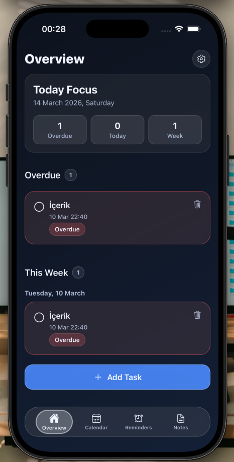
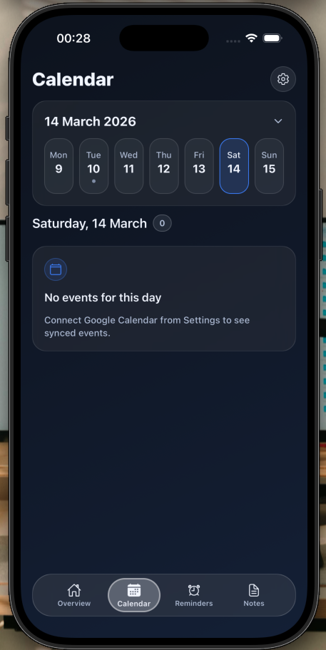
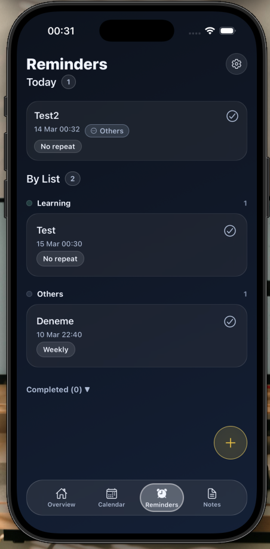
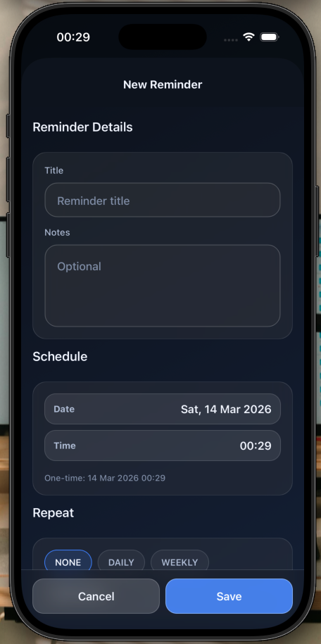
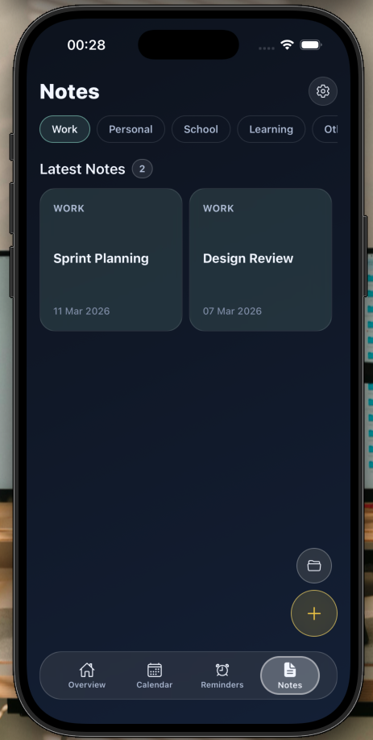
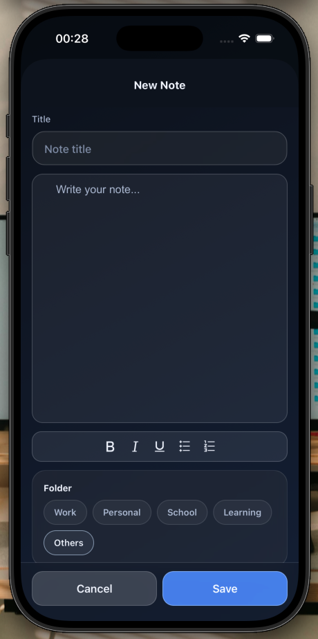
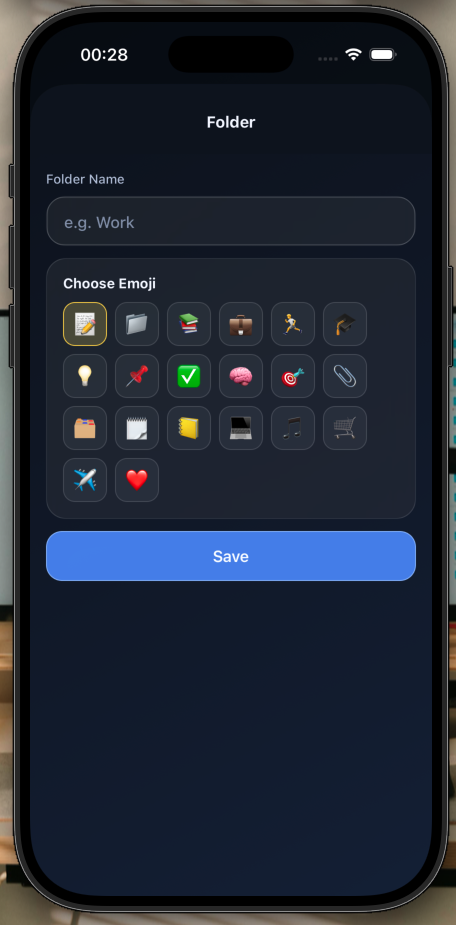

# Taskestra

Taskestra, Expo (SDK 54) ve React Native ile geliştirilen modern bir productivity uygulamasıdır.
Uygulama; `Overview`, `Calendar`, `Reminders` ve `Notes` modüllerini içerir.

## Proje Yapısı

- Uygulama kodu: `mobile/`
- Ekran görüntüleri: `mobile/assets/screenshots/`

## Kurulum

```bash
cd mobile
npm install
npm run start
```

Platform çalıştırma:

```bash
npm run ios
npm run android
```

## Ekran Görüntüleri

### Overview



### Calendar



### Reminders

| Home | Add Reminder |
|---|---|
|  |  |

### Notes

| Notes Home | Add Note | Add Folder |
|---|---|---|
|  |  |  |
